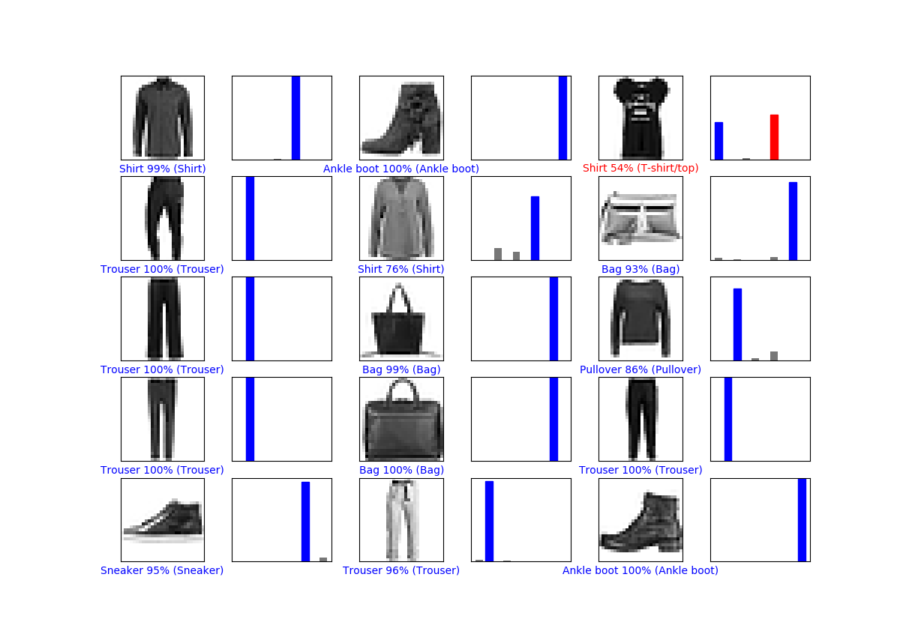
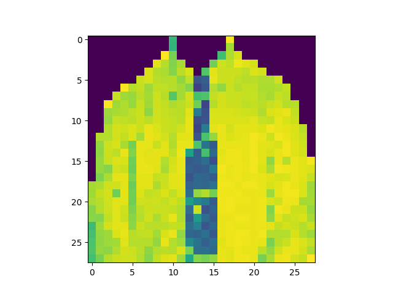
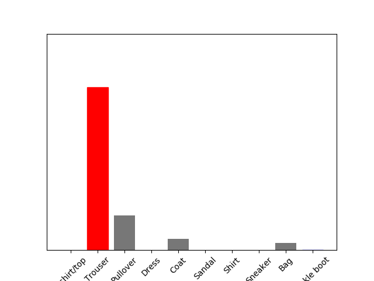
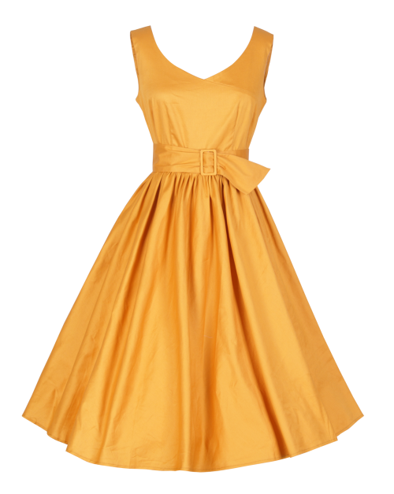
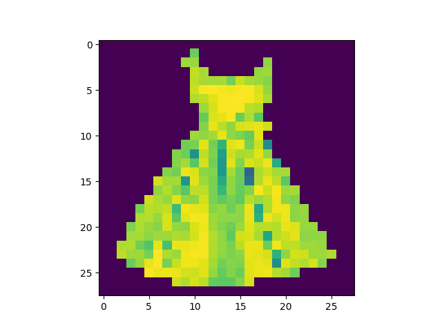
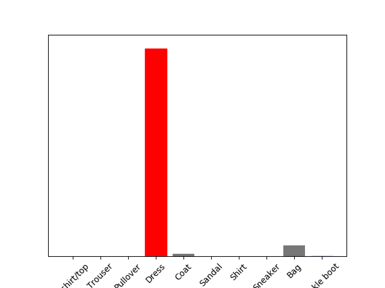
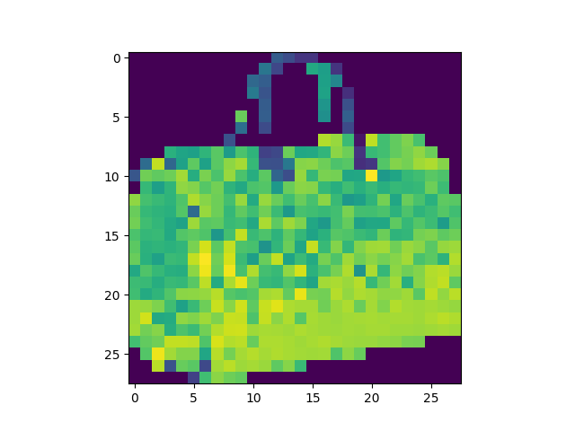
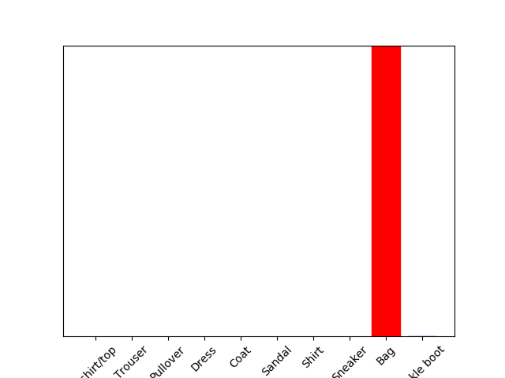

# checkpoint1

# checkpoint2

# checkpoint3
The revised image is saved as the printing result image  
the real size is (28,28)  
## original

## processed

## prediction

## original

## processed

## prediction

## original

## processed

## prediction

